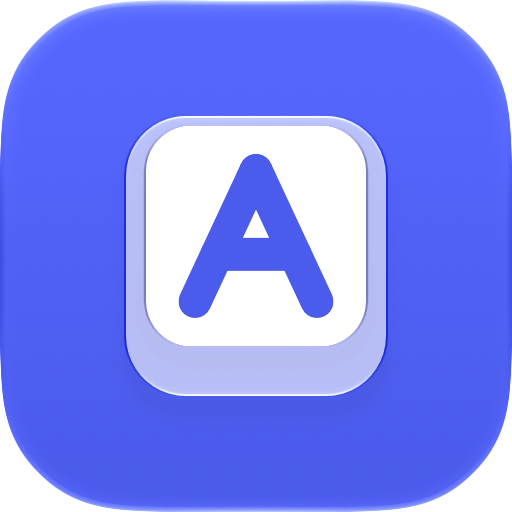

# BetterTab

A ⌘⇥ for the windows of the app you're in.

⌘⇥ switches between apps, so with two Chrome windows open it always takes you to the one you used
last. BetterTab adds ⌘§, the key above Tab: it does for the front app's windows what ⌘⇥ does for
apps. And the native ⌘⇥ switcher shows which apps have more than one window.

## Install

1. Download the `.dmg` from [the latest release](https://github.com/Luksanss/betterTab/releases/latest),
   open it, and drag BetterTab onto Applications.
2. Open it. The first time, macOS blocks it because it isn't notarized: go to System Settings →
   Privacy & Security and click Open Anyway.
3. When macOS asks, switch BetterTab on under Accessibility. It's the only permission it needs.

It needs macOS 27.

To update, choose Check for Updates… in BetterTab's menu. If there's a newer version, Install
Update replaces the app and relaunches it, and the Accessibility permission carries over. Updating
this way works from the first version that has the menu item; install that one by hand.

## Use

To switch between the windows of the app you're in, hold ⌘ and press §, the key above Tab on an
ISO keyboard. It works like ⌘⇥, but for that app's windows: each tile shows where its window sits
on its display.

| Key, with ⌘ held | What happens |
|---|---|
| **§** / **⇧§** | Moves to the next / previous window |
| **⌘** released | Opens the highlighted window |
| **A, S, D…** | Opens that window at once |
| **Esc** | Cancels |

A quick ⌘§ tap flips to the window you were in before.

⌘⇥ stays exactly as macOS has it. While you cycle, apps with more than one window show the edges
of more windows stacked behind their icon, so you know when ⌘§ will have somewhere to go.

The menu-bar item shows whether BetterTab is active and which version it is, and has Launch at
Login, Check for Updates… and Quit. There are no settings.

## Build

Open `BetterTab.xcodeproj`, choose your own team under Signing & Capabilities (a free Personal
Team works), and build the BetterTab scheme. Don't use "Sign to Run Locally": macOS would forget
the Accessibility grant on every rebuild.

## Privacy

BetterTab goes online only when you choose Check for Updates…, to ask GitHub for the latest
release and, if you click Install, to download it. Nothing about you or your Mac is sent. There's
no analytics or crash reporting. Window titles and positions stay in memory only while a switcher
is open, and are never logged.

## More

How it works, the spec and the tests are in [`docs/`](docs/). The window filter and the make-key
event follow [yabai](https://github.com/koekeishiya/yabai) (MIT). AltTab, DockDoor and WindowLens
were read to learn the approach; no code comes from them.
